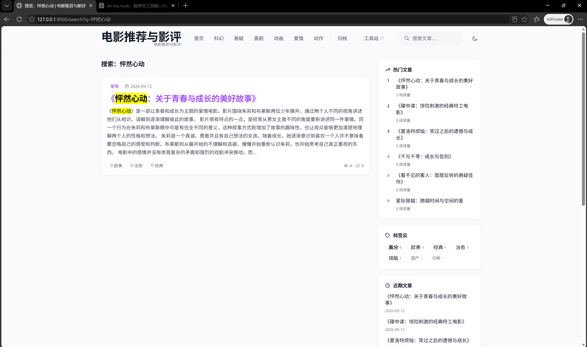
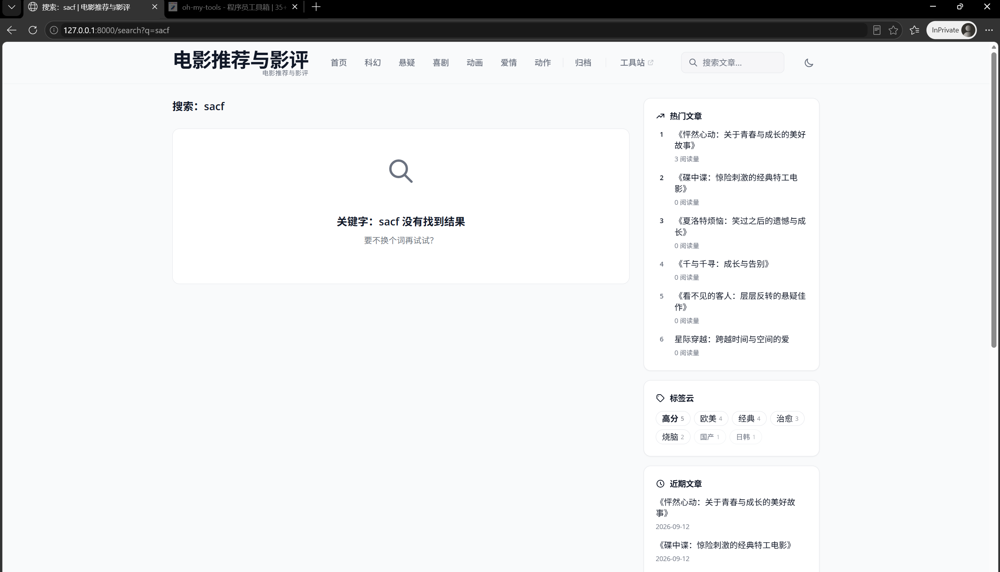
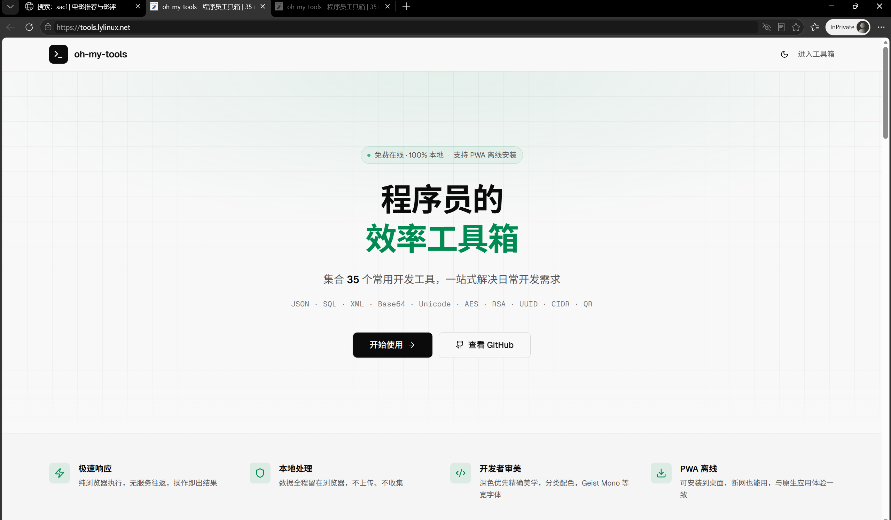
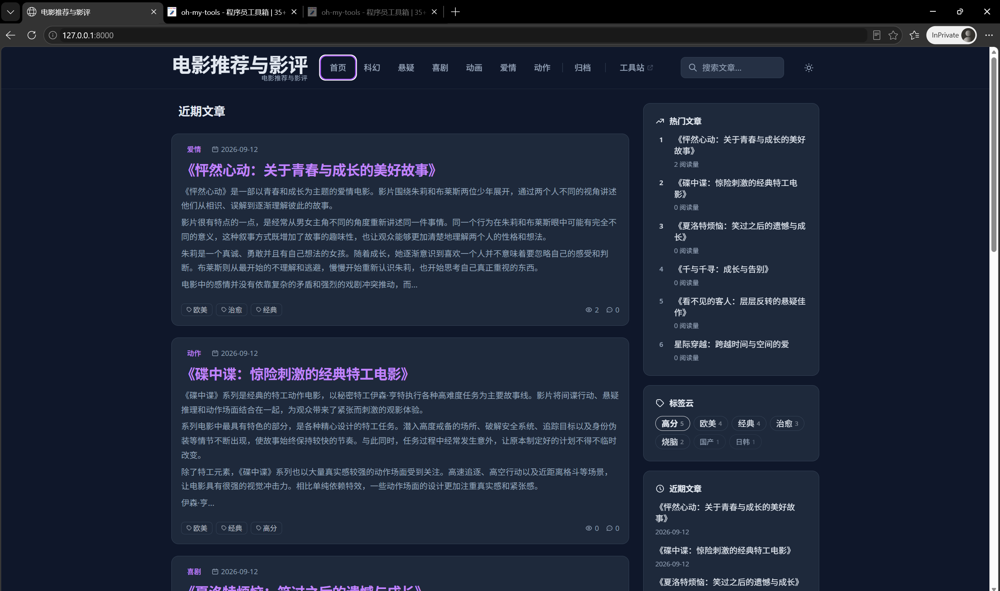
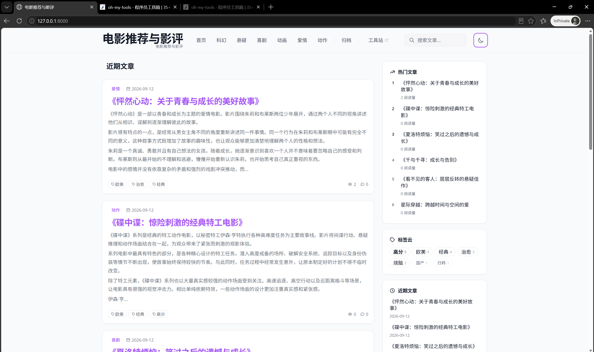
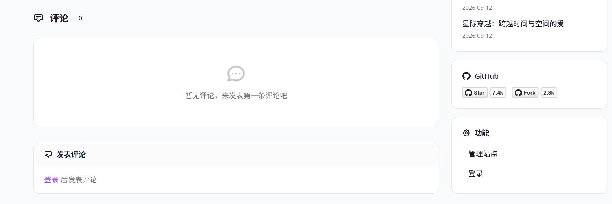
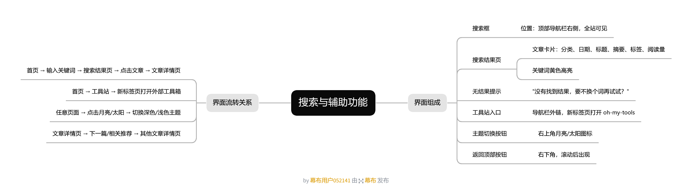
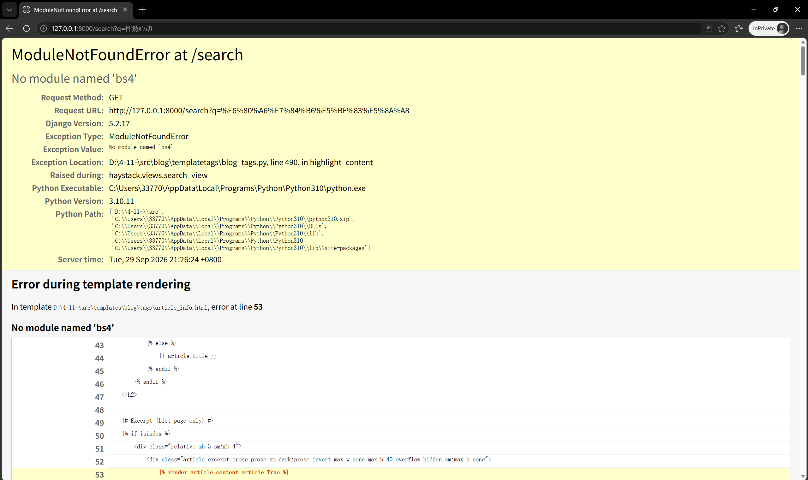

# 第四周界面分析——搜索与工具站/辅助功能

**班级：软件工程4班　姓名：郑智洋　学号：2415304401**

## 一、搜索功能说明

搜索入口位于顶部导航栏右侧的"搜索文章..."输入框。

测试过程：
1. 输入"怦然心动"回车 → 跳转搜索结果页，显示匹配文章，搜索内容标为黄色；点击结果进入文章详情页，跳转正常。

2. 输入乱码回车 → 页面显示"没有找到结果 / 要不换个词再试试？"。

3. 搜索内容包含全站文章标题与正文，范围广。

## 二、工具站说明

导航栏"工具站"为外部链接，点击在新标签页打开如图，提供开发工具。与博客主站无密切关系，是一个适用于读者的实用工具入口。

## 三、辅助功能说明

1. 明暗主题切换：右上角月亮/太阳图标，点击即时切换浅色/深色主题。

2. 返回顶部：页面向下滚动，右下角出现紫色按钮，点击回到顶部。

3. 评论功能：文章底部评论区，登录后可发表评论。

## 四、界面流转思维导图

首页→输入关键词→搜索结果页→文章详情页；首页→工具站（外部新标签页）；任意页面→主题切换。

## 五、测试过程中发现的问题

### 问题1：搜索有结果时页面崩溃（已解决）

- 现象：搜索"怦然心动"时报错 ModuleNotFoundError: No module named 'bs4'；搜无结果的关键词正常
- 原因：搜索结果页的关键词高亮功能依赖 beautifulsoup4 库，本地环境未安装
- 解决：pip install beautifulsoup4 后恢复正常
- 建议：小组"前置工作指南"依赖安装步骤中补充 beautifulsoup4

### 问题2：导入数据时报 BlogUser 不存在
- 现象：python manage.py loaddata blog_fixture.json 报错 BlogUser matching query does not exist
- 原因：fixture 中文章的作者账号在本地数据库不存在，应该先创建作者账号然后导入

### 问题3：前端静态资源需自行构建（环境）
- 现象：代码直接运行页面无样式
- 解决：在 frontend 目录执行 npm install 和 npm run build 生成 dist 目录后样式正常