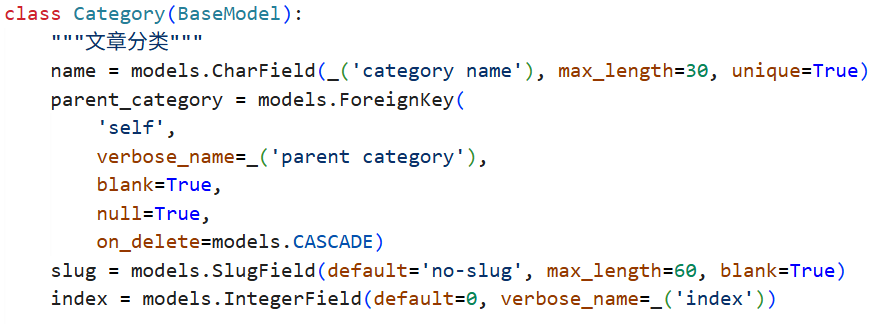
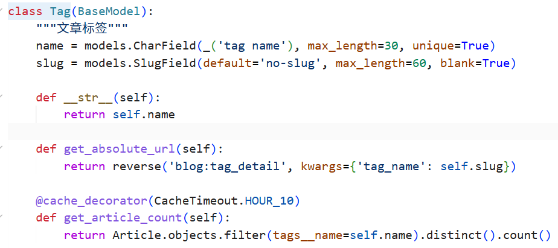
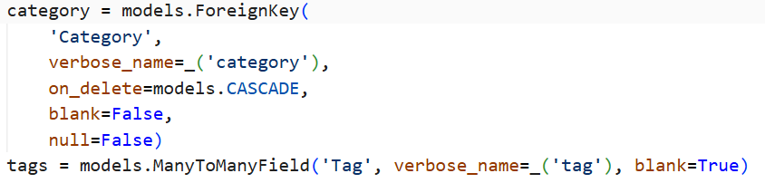

# 组员3：分类与标签数据模型分析

## 一、分析范围

本材料分析 DjangoBlog 项目 `blog/models.py` 中与文章分类、文章标签相关的数据模型，包括：

- `Category`：文章分类
- `Tag`：文章标签
- `Article` 中与 `Category`、`Tag` 的关联字段

以上模型均继承自 `BaseModel`。

## 二、Category（分类）模型分析

**Model 名称：** Category  
**文件位置：** `blog/models.py`  
**继承：** BaseModel

**主要字段：**

| 字段名 | 字段类型 | 主键/外键 | 说明 |
|---|---|---|---|
| id | AutoField | 主键 | Django 自动生成的主键 |
| name | CharField(max_length=30, unique=True) | - | 分类名称，如“科幻”“悬疑”，唯一 |
| parent_category | ForeignKey('self', null=True, blank=True, on_delete=CASCADE) | 外键（自关联） | 父分类，支持分类层级 |
| slug | SlugField(max_length=60, blank=True) | - | URL 别名 |
| index | IntegerField(default=0) | - | 排序索引 |
| created_time | DateTimeField | - | 继承自 BaseModel，创建时间 |
| last_mod_time | DateTimeField | - | 继承自 BaseModel，最后修改时间 |

> 注：`created_time`、`last_mod_time` 来自 BaseModel，具体字段名以 BaseModel 定义为准。

**模型职责：** 用于对文章按电影类型进行分类，一个分类可以包含多篇文章，并支持父子分类结构。

**与文章的关系：** Article 中通过 `category = ForeignKey('Category')` 引用分类，关系类型为**一对多（1:N）**。

**代码截图：**

图 1 `blog/models.py` 中 Category 模型定义。

## 三、Tag（标签）模型分析

**Model 名称：** Tag  
**文件位置：** `blog/models.py`  
**继承：** BaseModel

**主要字段：**

| 字段名 | 字段类型 | 主键/外键 | 说明 |
|---|---|---|---|
| id | AutoField | 主键 | Django 自动生成的主键 |
| name | CharField(max_length=30, unique=True) | - | 标签名称，如“欧美”“治愈”，唯一 |
| slug | SlugField(max_length=60, blank=True) | - | URL 别名 |
| created_time | DateTimeField | - | 继承自 BaseModel，创建时间 |
| last_mod_time | DateTimeField | - | 继承自 BaseModel，最后修改时间 |

> 注：`created_time`、`last_mod_time` 来自 BaseModel。

**模型职责：** 用于对文章按主题、地区、风格等维度进行更细粒度的标注，便于用户按标签查找文章。

**与文章的关系：** Article 中通过 `tags = ManyToManyField('Tag')` 与标签关联，关系类型为**多对多（M:N）**。

**代码截图：**

图 2 `blog/models.py` 中 Tag 模型定义。

## 四、Article 中与分类、标签的关系

**代码截图：**

图 3 Article 中 category 与 tags 字段定义。

关系说明：

- `category = ForeignKey('Category', on_delete=CASCADE, null=False)`：文章与分类为**一对多（1:N）**，一篇文章只能属于一个分类，一个分类可对应多篇文章。`on_delete=CASCADE` 表示分类删除时文章也会被删除。
- `tags = ManyToManyField('Tag', blank=True)`：文章与标签为**多对多（M:N）**，一篇文章可以有多个标签，一个标签也可对应多篇文章。

## 五、关系汇总

| 关系 | 两端 | 类型 | 说明 |
|---|---|---|---|
| 文章 - 分类 | Article ↔ Category | 1:N | 一篇文章属于一个分类，一个分类下有多篇文章 |
| 文章 - 标签 | Article ↔ Tag | M:N | 一篇文章可有多个标签，一个标签可对应多篇文章 |
| 分类 - 分类 | Category ↔ Category | 1:N（自关联） | 一个父分类可有多个子分类 |