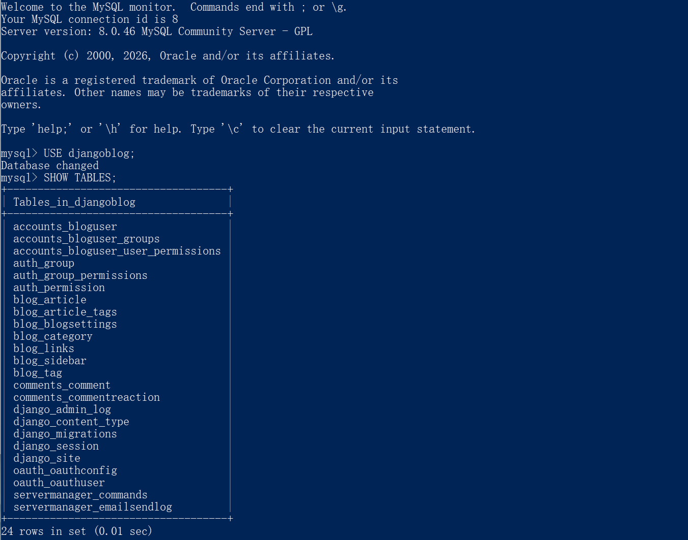
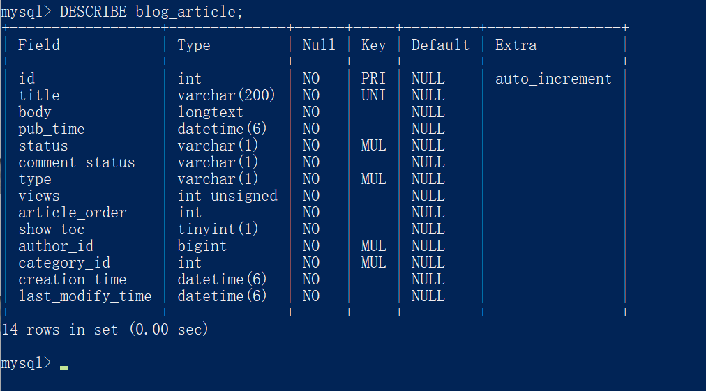
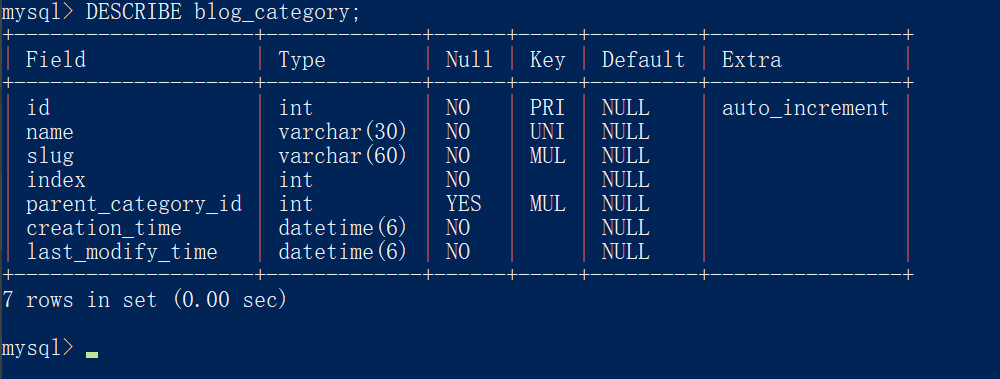
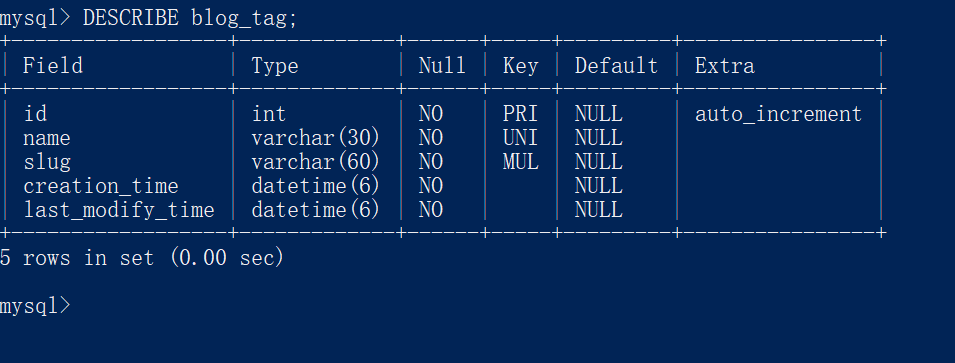
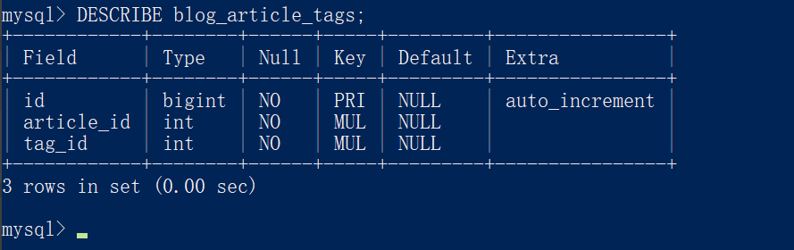
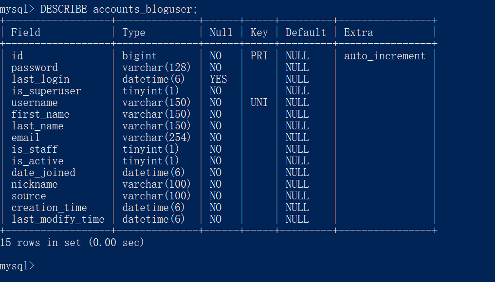
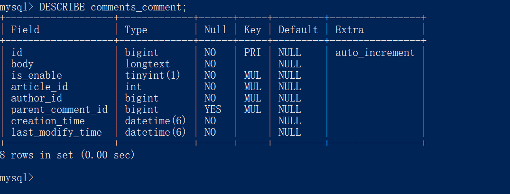
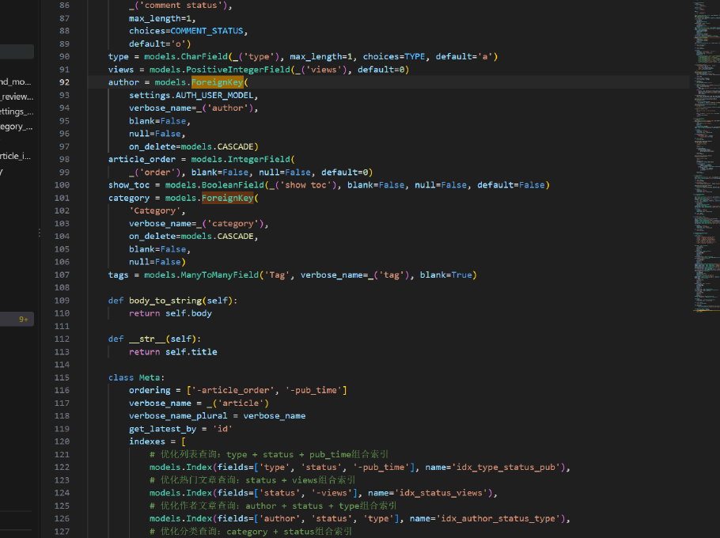

# 数据库主要表结构整理
班级：软件工程4班　姓名：郑智洋　学号：2415304401

## 一、数据库总览
数据库 djangoblog 共 24 张表。按用途分为四类：
- 核心业务表（6 张）：blog_article、blog_category、blog_tag、blog_article_tags、accounts_bloguser、comments_comment
- 博客辅助表：blog_blogsettings（站点设置）、blog_links（友情链接）、blog_sidebar（侧边栏）
- 多对多中间表：accounts_bloguser_groups、accounts_bloguser_user_permissions（用户与权限）
- 其他表：auth_*、django_*（Django 框架内置），oauth_*（第三方登录相关）、servermanager_*（站点管理相关）

## 二、核心业务表结构

### 1. blog_article（文章表）
- 对应 Model：blog.models.Article
- 主键：id（int，自增）
- 外键：
  - author_id（bigint）→ accounts_bloguser.id，一篇文章属于一个作者
  - category_id（int）→ blog_category.id，一篇文章属于一个分类
- 主要字段：title（varchar(200)，唯一）、body（longtext，正文）、pub_time（发布时间）、status（发布状态）、type（文章类型）、views（阅读量，int unsigned）、article_order（排序）、show_toc（是否显示目录）、creation_time / last_modify_time（创建与最后修改时间）
- 与标签的关系：不直接存标签，通过中间表 blog_article_tags 实现多对多

### 2. blog_category（分类表）
- 对应 Model：blog.models.Category
- 主键：id（int，自增）
- 外键：parent_category_id（int，可为空）→ blog_category.id 自身，构成分类树（自关联），支持父分类/子分类
- 主要字段：name（varchar(30)，唯一）、slug（URL 别名）、index（排序）、creation_time、last_modify_time
- 职责：存储文章分类，与文章为 1:N 关系

### 3. blog_tag（标签表）
- 对应 Model：blog.models.Tag
- 主键：id（int，自增）
- 无外键
- 主要字段：name（varchar(30)，唯一）、slug、creation_time、last_modify_time
- 职责：存储标签，与文章为 M:N 关系，通过中间表实现

### 4. blog_article_tags（多对多中间表）⭐
- 来源：Django 根据 Article 模型中的 ManyToManyField 自动生成，无独立 Model 文件
- 主键：id（bigint）
- 字段：article_id（int）→ blog_article.id；tag_id（int）→ blog_tag.id
- 说明：仅含两个外键，是多对多关系的标准实现方式，一行代表"某篇文章拥有某个标签"

### 5. accounts_bloguser（用户表）
- 对应 Model：accounts.models.BlogUser（继承 Django 内置 AbstractUser）
- 主键：id（bigint，自增）
- 无外键（通过中间表与权限组关联）
- 主要字段：username（varchar(150)，唯一）、password（varchar(128)，加密存储）、email、nickname（昵称）、is_superuser / is_staff / is_active（权限与状态标记）、last_login、date_joined、source（注册来源）、creation_time、last_modify_time

### 6. comments_comment（评论表）
- 对应 Model：comments.models.Comment
- 主键：id（bigint，自增）
- 外键：
  - article_id（int）→ blog_article.id，一条评论属于一篇文章
  - author_id（bigint）→ accounts_bloguser.id，一条评论属于一个用户
  - parent_comment_id（bigint，可为空）→ comments_comment.id 自身，支持评论回复（楼中楼，自关联）
- 主要字段：body（longtext，评论内容）、is_enable（是否显示）

## 三、表间关系汇总
- 分类 1:N 文章（blog_category.id ← blog_article.category_id）
- 用户 1:N 文章（accounts_bloguser.id ← blog_article.author_id）
- 文章 M:N 标签（经 blog_article_tags 中间表）
- 文章 1:N 评论；用户 1:N 评论；评论自关联（parent_comment_id）支持回复
- 分类自关联（parent_category_id）支持多级分类

## 四、数据库与 Model 核对
已对照 blog/models.py 与 accounts/models.py 核对，结论一致：
- Article.author 为 ForeignKey → 对应表中 author_id 外键；
- Article.category 为 ForeignKey → 对应 category_id 外键，且均设置 on_delete=models.CASCADE（作者或分类被删除时，关联文章一并删除）；
- Article.tags 为 ManyToManyField → 对应自动生成的中间表 blog_article_tags。
代码与数据库结构无差异。

